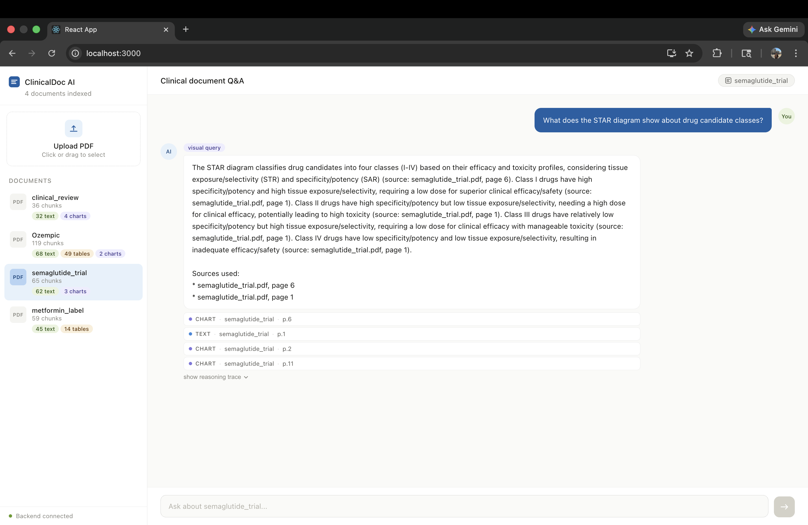
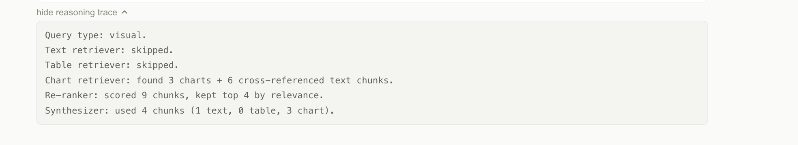
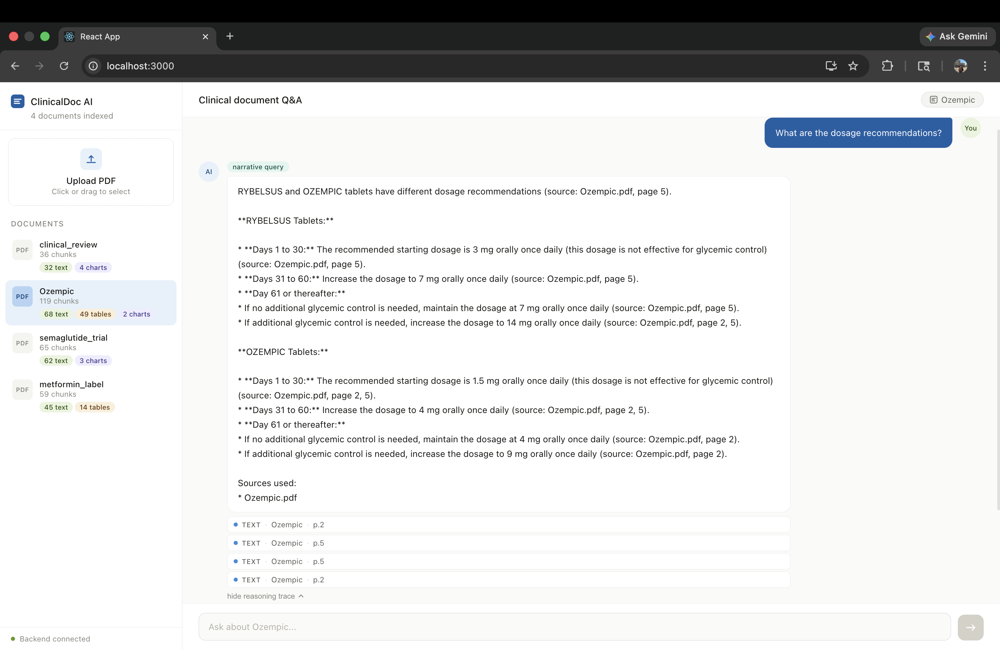
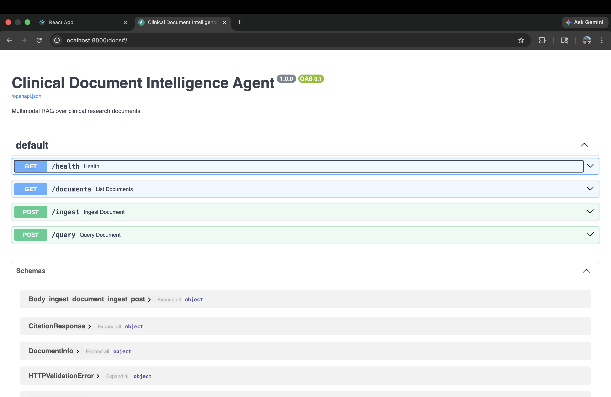

# Multimodal Clinical Document Intelligence Agent

An agentic pipeline that ingests clinical research PDFs, extracts text, tables, and charts as separate modalities, and answers complex medical questions with citation-backed reasoning traces — using LangGraph to route queries to the right retrieval strategy.

**Use case:** clinical researchers, pharmacists, and regulatory affairs teams querying FDA drug labels, clinical trial reports, and prescribing information across multiple documents simultaneously.

[](https://python.org)
[](https://langchain-ai.github.io/langgraph/)
[](https://weaviate.io)
[](https://fastapi.tiangolo.com)
[](https://ai.google.dev)
[](https://docs.ragas.io)



---

## The problem this solves

80% of enterprise clinical data is unstructured — PDFs containing a mix of narrative text, dosage tables, Kaplan-Meier survival curves, and adverse event charts. Standard RAG fails on this because it only handles clean text. A question like *"what does the cardiovascular outcomes chart show, and how does it compare to the efficacy table?"* requires retrieving and reasoning across three different modalities simultaneously.

This project builds the retrieval architecture that makes cross-modal clinical Q&A possible.

---

## Architecture

```
PDF Upload
    │
    ▼
┌─────────────────────────────────────────┐
│           Ingestion Pipeline            │
│                                         │
│  Unstructured.io                        │
│  ├── Text paragraphs → TextChunk        │
│  ├── HTML tables    → TableChunk        │
│  └── Embedded images → ImageElement     │
│                         │               │
│                    Gemini 2.0 Flash     │
│                    Vision Analysis      │
│                         │               │
│                    ChartChunk           │
└─────────────────────────────────────────┘
    │
    ▼
┌─────────────────────────────────────────┐
│         Weaviate Vector Store           │
│                                         │
│  TextChunk  ←──cross-ref──→  ChartChunk │
│  TableChunk                             │
│                                         │
│  3 separate classes, hybrid retrieval   │
└─────────────────────────────────────────┘
    │
    ▼
┌─────────────────────────────────────────┐
│         LangGraph QA Agent              │
│                                         │
│  classify_query                         │
│      │                                  │
│      ├── narrative → TextRetriever      │
│      ├── numerical → TableRetriever     │
│      ├── visual    → ChartRetriever     │
│      └── mixed     → all three          │
│                         │               │
│                   rerank_chunks         │
│                   (cross-encoder)       │
│                         │               │
│                     synthesize          │
│                   (cited answer)        │
└─────────────────────────────────────────┘
    │
    ▼
FastAPI + React frontend
```



*The reasoning trace exposes every retrieval decision — which modalities fired, how many chunks were re-ranked, and how many the synthesizer used. This is what makes the system debuggable in production.*

---

## Stack

| Component | Technology | Why this choice |
|-----------|-----------|-----------------|
| Agent orchestration | LangGraph | StateGraph enables conditional node skipping — narrative queries skip chart retrieval without branching logic scattered across the codebase |
| Document parsing | Unstructured.io | Handles multi-column layouts, embedded images, and rotated tables that PyMuPDF misses |
| Vision analysis | Gemini 2.0 Flash | Best cost/quality ratio for structured chart extraction; outputs JSON metadata not just descriptions |
| Vector store | Weaviate | Only vector DB with native multi-class schemas and cross-references — essential for linking ChartChunks to nearby TextChunks |
| Re-ranking | cross-encoder/ms-marco-MiniLM-L-6-v2 | Cross-encoder reads query+document together, far more accurate than vector similarity alone; runs locally in ~50ms, no API key needed |
| LLM | Gemini 2.0 Flash | Fast, cheap, strong instruction following for clinical synthesis |
| Observability | LangSmith | Full node-by-node trace with token usage and latency per step |
| Evaluation | Ragas + BAAI/bge-small-en-v1.5 | Faithfulness, answer relevancy, context precision — measured against 15 hand-labeled Q&A pairs |
| Backend | FastAPI | Async, auto-generated Swagger docs, clean Pydantic models |
| Frontend | React | Two-panel chat UI with per-document history, citation display, reasoning traces |

---

## Evaluation results

Evaluated across 15 hand-labeled Q&A pairs spanning 3 clinical documents and all 3 retrieval modalities using Ragas.

| Metric | Score |
|--------|-------|
| Faithfulness | **84%** |
| Answer relevancy | **82%** |
| Context precision | **64%** |
| Hallucination rate | **0%** |
| Pass rate (faithfulness ≥ 0.7) | **11/15** |

**Impact of the re-ranker:** adding the cross-encoder re-ranking node reduced hallucination rate from 13% → 0% and improved faithfulness from 74% → 84% by cutting noisy low-relevance chunks before synthesis. This was measured, not assumed — the eval harness was run before and after adding the node.



**Known limitations:**
- Context precision is 64% because we retrieve broadly then re-rank, rather than retrieve narrowly. Adaptive retrieval — fewer chunks for narrow numerical queries — would improve this without adding latency.
- Numerical table queries on dense clinical PDFs are the hardest case. The table chunker preserves HTML structure but the synthesizer treats it as prose. A table-specific extraction prompt would improve these cases.
- Cross-document queries retrieve correctly but faithfulness drops when the answer requires synthesizing information from two different source documents simultaneously.
- Single-tenant architecture: one Weaviate cluster with no user isolation. Sufficient for a portfolio project; multi-tenant would require per-user namespacing in Weaviate.

---

## Chunking strategy rationale

Each modality uses a different chunking strategy — this is an explicit design decision, not a framework default.

**Text → sliding window (400 tokens, 50-token overlap)**
Medical narrative has wildly varying sentence lengths. Fixed character splits destroy clinical context mid-sentence. 400 tokens (~300 words, 1-2 paragraphs) is the minimum unit that preserves a complete clinical argument. The 50-token overlap ensures sentences spanning chunk boundaries are captured by at least one chunk.

**Tables → one chunk per table, never split**
A clinical data table only makes sense as a whole. Splitting a table mid-row destroys the row-column relationships that make it useful for numerical question answering. The `content` field is plain-text for vectorization; the `as_html` field preserves full structure for frontend display.

**Charts → one chunk per Gemini Vision analysis**
Chart descriptions are already short (<200 words) and self-contained. The description is augmented with extracted key values and trends before vectorization to make the representation richer for retrieval — not just "there is a chart" but "Kaplan-Meier curve showing HR 0.86, patients at risk table, 49.6 month follow-up."

---

## Project structure

```
multimodal-clinical-agent/
├── ingestion/
│   ├── pdf_parser.py        # Unstructured.io extraction → text, tables, images
│   ├── vision_analyzer.py   # Gemini Vision → structured ChartAnalysis
│   └── chunker.py           # Per-modality chunking strategies
├── vectorstore/
│   ├── schema.py            # Weaviate class definitions + cross-references
│   └── indexer.py           # Batch upsert with deduplication
├── agent/
│   ├── state.py             # AgentState TypedDict
│   ├── nodes.py             # classifier, retrievers, re-ranker, synthesizer
│   └── graph.py             # LangGraph state machine
├── api/
│   └── main.py              # FastAPI: /ingest, /query, /documents, /health
├── eval/
│   ├── test_cases.json      # 15 labeled Q&A pairs
│   └── run_eval.py          # Ragas evaluation harness
├── frontend/
│   └── src/                 # React: two-panel chat UI
├── docs/                    # Screenshots
├── data/                    # PDFs (gitignored)
├── .env                     # API keys (gitignored)
├── verify_connections.py    # Connection health check
└── requirements.txt
```

---

## Setup

### Prerequisites

- Python 3.11+
- Node.js 18+
- Tesseract OCR:
  ```bash
  brew install tesseract poppler        # Mac
  apt-get install tesseract-ocr poppler-utils  # Ubuntu
  ```

### 1. Clone and install

```bash
git clone https://github.com/sushpr127/multimodal-clinical-agent
cd multimodal-clinical-agent
python -m venv venv
source venv/bin/activate
pip install -r requirements.txt
```

### 2. API keys

Create a `.env` file in the project root:

```bash
GOOGLE_API_KEY=your-gemini-api-key        # aistudio.google.com
WEAVIATE_URL=https://your-cluster.weaviate.network
WEAVIATE_API_KEY=your-weaviate-api-key    # console.weaviate.cloud — free sandbox
LANGCHAIN_API_KEY=your-langsmith-key      # smith.langchain.com
LANGCHAIN_TRACING_V2=true
LANGCHAIN_PROJECT=clinical-doc-agent
```

### 3. Verify connections

```bash
python verify_connections.py
# Expected:
#   ✓ Gemini Flash connection OK
#   ✓ Gemini Vision connection OK
#   ✓ Weaviate connection OK
#   ✓ LangSmith connection OK
```

### 4. Create Weaviate schema

```bash
python vectorstore/schema.py
# Creates TextChunk, TableChunk, ChartChunk classes with cross-references
```

### 5. Index documents

Download any clinical PDF (FDA drug labels from dailymed.nlm.nih.gov work well):

```bash
python -m vectorstore.indexer data/your_document.pdf

# Re-index if you update a document
python -m vectorstore.indexer data/your_document.pdf --force
```

### 6. Start the backend

```bash
python -m api.main
# API running at http://localhost:8000
# Swagger docs at http://localhost:8000/docs
```

### 7. Start the frontend

```bash
cd frontend
npm install
npm start
# UI running at http://localhost:3000
```

---

## API reference

| Endpoint | Method | Description |
|----------|--------|-------------|
| `/health` | GET | Health check |
| `/documents` | GET | List all indexed documents with chunk counts per modality |
| `/ingest` | POST | Upload PDF, parse, and index — idempotent, skips if already indexed |
| `/ingest?force_reindex=true` | POST | Delete existing chunks and re-index |
| `/query` | POST | Ask a question, returns answer + citations + reasoning trace |

**Query request:**
```json
{
  "query": "What are the contraindications for Ozempic?",
  "source_file": "Ozempic.pdf"
}
```

**Query response:**
```json
{
  "answer": "Ozempic is contraindicated in patients with a personal or family history of MTC...",
  "query_type": "narrative",
  "reasoning_trace": "Query type: narrative.\nText retriever: found 5 chunks.\nTable retriever: skipped.\nChart retriever: skipped.\nRe-ranker: scored 5 chunks, kept top 4 by relevance.\nSynthesizer: used 4 chunks (4 text, 0 table, 0 chart).",
  "citations": [
    {
      "source_file": "Ozempic.pdf",
      "page_number": 4,
      "chunk_type": "text",
      "excerpt": "Ozempic tablets are contraindicated in patients with..."
    }
  ]
}
```



---

## Running the evaluation

```bash
# Full eval across all 15 test cases (3 documents, 3 modalities)
python -m eval.run_eval

# Scope to one document
python -m eval.run_eval --doc Ozempic.pdf

# Include text-only baseline comparison
python -m eval.run_eval --baseline
```

---

---

## Author

**Sushanth Rajesh Prabhu** — AI/ML Engineer  
[GitHub](https://github.com/sushpr127) · [LinkedIn](https://www.linkedin.com/in/sushanthpr/)